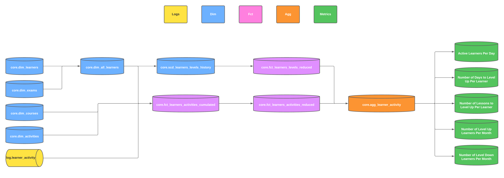

# Monitoring Learner Activity

## Group

Solo Queue

- Cristopher Freitas

## Problem Statement

We're a team of data engineers at a large online language learning platform.
We're responsible for building a data pipeline that will measure learner engagement and tracks their progress.

## Business Metrics

- How many active learners?
- How many learners moved up a level?
- How many days it takes for a learner to move up a level?
- How many learners moved down a level?
- How many activities take for a learner to move up a level?

## Assumptions

- We're considering a learner to be active if they complete at least one activity per day.
- We're considering a learner to be stalled if they haven't completed any activities in the last 7 days.
- A learner level follows the CEFR scale (A1, A2, B1, B2, C1, C2).
- A learner can move up or down multiple levels per month.
- Each month, a learner's level is determined by an exam that they take.

## Upstream Sources

- Learner Profile (`core.dim_learners`) -- contains information about the learner (e.g. name, email, country, etc.)
- Course Catalog (`core.dim_courses`) -- contains information about the courses (e.g. name, description, etc.)
- Course Activities (`core.dim_course_activities`) -- contains information about the lessons and activities (e.g. name,
  description, etc.)
- Learner Activity (`log.learner_activity`) -- contains information about the learner's activity (e.g. lesson_id,
  activity_id, date, etc.)
- Learner Exam -- (`core.dim_exams`) contains information about the learner's exam (e.g. date, level, etc.)

## Pipeline Diagram

## Data Schemas/Modeling

### Dimension Table: All Learners (`dim_all_learners`)

| Column               | Data Type | Description                                                         |
|----------------------|-----------|---------------------------------------------------------------------|
| learner_id           | INT       | Unique identifier for the learner                                   |
| dim_first_name       | TEXT      | First name of the learner                                           |
| dim_last_name        | TEXT      | Last name of the learner                                            |
| dim_level            | TEXT      | Current CEFR level of the learner                                   |
| dim_last_level_date  | DATE      | Date when the learner last took an exam                             |
| dim_is_active        | BOOLEAN   | Flag indicating if the learner is active or not                     |
| dim_last_active_date | DATE      | Date of the last activity completed by the learner                  |
| activities           | ARRAY[]   | Array of struct for activities completed by the learner* |
| date                 | DATE      | The business process date for the current state of the record       |

* The array of struct for activities contains the following fields:

- `date_completed` -- Date when the activity was completed
- `course_id` -- Unique identifier for the course
- `lesson_id` -- Unique identifier for the lesson
- `activity_id` -- Unique identifier for the activity
- `score` -- Score of the activity

### SCD Type 2 Dimension Table: Learners Levels History (`scd_learners_levels_history`)

| Column        | Data Type | Description                                                   |
|---------------|-----------|---------------------------------------------------------------|
| learner_id    | INT       | Unique identifier for the learner                             |
| current_date  | DATE      | The business process date for the current state of the record |
| start_date    | DATE      | Start date for the partition                                  |
| end_date      | DATE      | End date for the partition                                    |
| dim_is_active | BOOLEAN   | Flag indicating if the learner is active or not               |
| dim_level     | TEXT      | Current CEFR level of the learner                             |

### Fact Table: Learners Activities Cumulated (`fct_learners_activities_cumulated`)

| Column                        | Data Type  | Description                                                           |
|-------------------------------|------------|-----------------------------------------------------------------------|
| learner_id                    | INT        | Unique identifier for the learner                                     |
| date                          | DATE       | The business process date for the current state of the record         |
| activities_completed_datelist | ARRAY[INT] | Array of number of activities completed per day over the last 30 days |

### Fact Table: Learners Activities Reduced (`fct_learners_activities_reduced`)

| Column                       | Data Type | Description                                                   |
|------------------------------|-----------|---------------------------------------------------------------|
| learner_id                   | INT       | Unique identifier for the learner                             |
| dim_level                    | TEXT      | Current CEFR level of the learner                             |
| m_total_activities_completed | TEXT      | Total number of activities completed                          |
| m_activities_completed_today | TEXT      | Number of activities completed at the `date`                  |
| date                         | DATE      | The business process date for the current state of the record |

### Fact Table: Learners Levels Reduced (`fct_learners_levels_reduced`)

| Column               | Data Type | Description                                                   |
|----------------------|-----------|---------------------------------------------------------------|
| learner_id           | INT       | Unique identifier for the learner                             |
| dim_level            | TEXT      | Current CEFR level of the learner                             |
| m_total_level_ups    | TEXT      | Total number of learners to move up a level                   |
| m_days_to_level_up   | TEXT      | Number of days to move up a level                             |
| m_total_level_downs  | TEXT      | Total number of learners to move down a level                 |
| m_days_to_level_down | TEXT      | Number of days to move down a level                           |
| date                 | DATE      | The business process date for the current state of the record |

### Aggregate Table: Learner Performance (`agg_learner_activity`)

| Column                       | Data Type | Description                                                   |
|------------------------------|-----------|---------------------------------------------------------------|
| dim_learner_level            | TEXT      | CEFR level of the learner                                     |
| m_active_learners_today      | INT       | Number of active learners at the `date`                       |
| m_total_activities_completed | INT       | Total number of activities completed                          |
| m_activities_completed_today | INT       | Number of activities completed at the `date`                  |
| m_total_level_ups            | INT       | Total number of learners to move up a level                   |
| m_level_ups_today            | INT       | Number of times the learner moved up a level today            |
| m_total_level_downs          | INT       | Total number of learners to move down a level                 |
| m_level_downs_today          | INT       | Number of times the learner moved down a level today          |
| m_max_days_to_level_up       | INT       | Maximum number of days it took for a learner to move up       |
| m_min_days_to_level_up       | INT       | Minimum number of days it took for a learner to move up       |
| m_avg_days_to_level_up       | INT       | Average number of days it took for a learner to move up       |
| m_max_days_to_level_down     | INT       | Maximum number of days it took for a learner to move down     |
| m_min_days_to_level_down     | INT       | Minimum number of days it took for a learner to move down     |
| m_avg_days_to_level_down     | INT       | Average number of days it took for a learner to move down     |
| date                         | DATE      | The business process date for the current state of the record |
| aggregation_level            | TEXT      | Aggregation level of the record                               |

## Data Quality Checks

### Data Quality Checks for Dimension Table: All Learners (`dim_all_learners`)

| Column               | Data Quality Check                                                         |
|----------------------|----------------------------------------------------------------------------|
| learner_id           | Ensure values are non-null, unique, and integer.                           |
| dim_first_name       | Ensure values are non-null and text.                                       |
| dim_last_name        | Ensure values are non-null and text.                                       |
| dim_level            | Ensure values are non-null, text, and conform to the CEFR scale.           |
| dim_last_level_date  | Ensure values are in YYYY-MM-DD format and not in the future.              |
| dim_is_active        | Ensure values are non-null and boolean.                                    |
| dim_last_active_date | Ensure values are in YYYY-MM-DD format and not in the future.              |
| activities           | Ensure it is an array of structs with the appropriate schema.              |
| date                 | Ensure values are in YYYY-MM-DD format and non-null.                       |

### Data Quality Checks for SCD Type 2 Dimension Table: Learners Levels History (`scd_learners_levels_history`)

| Column        | Data Quality Check                                                      |
|---------------|-------------------------------------------------------------------------|
| learner_id    | Ensure values are non-null, unique, and integer.                        |
| current_date  | Ensure values are in YYYY-MM-DD format and non-null.                    |
| start_date    | Ensure values are in YYYY-MM-DD format and non-null.                    |
| end_date      | Ensure values are either null or in YYYY-MM-DD format.                  |
| dim_is_active | Ensure values are non-null and boolean.                                 |
| dim_level     | Ensure values are non-null, text, and conform to the CEFR scale.        |

### Data Quality Checks for Fact Table: Learners Activities Cumulated (`fct_learners_activities_cumulated`)

| Column                        | Data Quality Check                                                 |
|-------------------------------|---------------------------------------------------------------------|
| learner_id                    | Ensure values are non-null and integer.                            |
| date                          | Ensure values are in YYYY-MM-DD format and non-null.               |
| activities_completed_datelist | Ensure it is an array of integers and each entry is non-negative.  |

### Data Quality Checks for Fact Table: Learners Activities Reduced (`fct_learners_activities_reduced`)

| Column                       | Data Quality Check                                                  |
|------------------------------|---------------------------------------------------------------------|
| learner_id                   | Ensure values are non-null and integer.                             |
| dim_level                    | Ensure values are non-null, text, and conform to the CEFR scale.    |
| m_total_activities_completed | Ensure values are non-null and numeric.                             |
| m_activities_completed_today | Ensure values are non-null and numeric.                             |
| date                         | Ensure values are in YYYY-MM-DD format and non-null.                |

### Data Quality Checks for Fact Table: Learners Levels Reduced (`fct_learners_levels_reduced`)

| Column               | Data Quality Check                                                  |
|----------------------|---------------------------------------------------------------------|
| learner_id           | Ensure values are non-null and integer.                             |
| dim_level            | Ensure values are non-null, text, and conform to the CEFR scale.    |
| m_total_level_ups    | Ensure values are non-null and numeric.                             |
| m_days_to_level_up   | Ensure values are non-null and numeric.                             |
| m_total_level_downs  | Ensure values are non-null and numeric.                             |
| m_days_to_level_down | Ensure values are non-null and numeric.                             |
| date                 | Ensure values are in YYYY-MM-DD format and non-null.                |

### Data Quality Checks for Aggregate Table: Learner Performance (`agg_learner_activities`)
| Column                       | Data Quality Check                                              |
|------------------------------|-----------------------------------------------------------------|
| dim_learner_level            | Ensure values are non-null, text, and conform to the CEFR scale.|
| m_active_learners_today      | Ensure values are non-null and integer.                         |
| m_total_activities_completed | Ensure values are non-null and integer.                         |
| m_activities_completed_today | Ensure values are non-null and integer.                         |
| m_total_level_ups            | Ensure values are non-null and integer.                         |
| m_level_ups_today            | Ensure values are non-null and integer.                         |
| m_total_level_downs          | Ensure values are non-null and integer.                         |
| m_level_downs_today          | Ensure values are non-null and integer.                         |
| m_max_days_to_level_up       | Ensure values are non-null and integer.                         |
| m_min_days_to_level_up       | Ensure values are non-null and integer.                         |
| m_avg_days_to_level_up       | Ensure values are non-null and numeric.                         |
| m_max_days_to_level_down     | Ensure values are non-null and integer.                         |
| m_min_days_to_level_down     | Ensure values are non-null and integer.                         |
| m_avg_days_to_level_down     | Ensure values are non-null and numeric.                         |
| date                         | Ensure values are in YYYY-MM-DD format and non-null.            |
| aggregation_level            | Ensure values are non-null and text.                            |
